# GD Agentic Skills: The Godot 4 Mastery Ecosystem

<div align="center">
  
</div>


<div align="center">

[](https://github.com/thedivergentai/gd-agentic-skills/stargazers)
[](LICENSE)
[](https://godotengine.org/)
[](skills_index.json)
[](https://github.com/thedivergentai/gd-agentic-skills/commits/main)

**"A skill forgotten is a power lost." — The Code Architect**

**Brought to you by [Divergent AI](https://github.com/thedivergentai)**

</div>

---

## 📍 Quick Navigation

| 🚀 Get Started | 🏆 Godot Master | 🧩 Micro-Skills | 🤖 Agent Protocol | ⭐ Star History |
|:---:|:---:|:---:|:---:|:---:|
| [Install](#-quick-start) | [All-in-One System](#-godot-master-your-lead-architect) | [Bite-Size Modules](#-micro-skills-bite-size-power) | [DIA Loop](#-for-agents-the-discovery-ingestion-application-protocol) | [Growth Chart](#-star-history) |

---

## The Philosophy

**Godot Agentic Skills** is a high-density, **Agent-First** knowledge library for Godot 4.5+—designed as an external "Long-Term Memory" (LTM) for AI Coding Agents. It provides structured, deterministic patterns for professional game and application engineering.

Unlike generic AI responses, every skill in this repository follows strictly defined Godot 4 best practices, architectural patterns, and performance optimization techniques refined by shipping real products.

**If this project helps your development or empowers your agents, please give it a star! 🌟**

---

## ⚡ Quick Start

Install via the [skills.sh](https://skills.sh) protocol:

```bash
npx skills add thedivergentai/gd-agentic-skills
```

**Manual Discovery**: Agents can directly query the machine-readable [`skills_index.json`](skills_index.json) for skill discovery and dependency mapping.

---

## 🏆 Godot Master — Your Lead Architect

The **godot-master** skill is the crown jewel of this repository—a consolidated expert library that orchestrates all 86 specialized skills into a unified architectural framework.

### 🎯 What Makes Godot Master Special?

Unlike individual micro-skills that focus on isolated features, **godot-master** is your *system architect*. It provides:

**📚 Comprehensive Knowledge Base**
- **85 Reference Documents**: Complete markdown guides for every skill, from foundations to advanced genres
- **170 Production Scripts**: Battle-tested, production-ready GDScript implementations
- **10 Workflow Patterns**: Step-by-step architectural workflows (scaffolding, entity orchestration, persistence, optimization, multiplayer, etc.)

**🧠 Expert Frameworks**
- **Architectural Decision Matrix**: Choose the right pattern for your project (component-driven, event-driven, resource-streaming, deterministic networking)
- **15 Anti-Patterns**: Explicit "NEVER DO THIS" rules with non-obvious explanations (e.g., why `get_tree().root.get_node()` breaks, why `load()` in `_process` kills performance)
- **Performance Budgets**: Concrete numbers for mobile/desktop targets (draw calls, triangle counts, script time)
- **Server API Patterns**: Expert escape hatch for 10K+ entities using RenderingServer/PhysicsServer RIDs

**🏗️ The Layer Cake Architecture**

Godot Master enforces a signal-based separation of concerns:

```mermaid
graph TD
    UI[🎨 PRESENTATION<br/>UI / VFX / Audio] -->|Signals ⬆️| LOGIC[⚙️ LOGIC<br/>State Machines / Controllers]
    LOGIC -->|Signals ⬆️| DATA[💾 DATA<br/>Resources / .tres / Stats]
    DATA -->|Signals ⬆️| INFRA[🌐 INFRASTRUCTURE<br/>Autoloads / Signal Bus / Managers]
    
    style UI fill:#1f2937,stroke:#58A6FF,stroke-width:2px,color:#fff
    style LOGIC fill:#1f2937,stroke:#79C0FF,stroke-width:2px,color:#fff
    style DATA fill:#1f2937,stroke:#A371F7,stroke-width:2px,color:#fff
    style INFRA fill:#1f2937,stroke:#F778BA,stroke-width:2px,color:#fff
```



**Critical Rule**: Signals travel UP only. Presentation layer never modifies Data directly. Infrastructure speaks exclusively through signals.

### 🔄 When to Use Godot Master vs Micro-Skills

```mermaid
flowchart LR
    START([New Task]) --> Q1{Starting a<br/>new project?}
    Q1 -->|Yes| MASTER[Use godot-master]
    Q1 -->|No| Q2{Need architectural<br/>guidance?}
    Q2 -->|Yes| MASTER
    Q2 -->|No| Q3{Building a<br/>complete system?}
    Q3 -->|Yes| MASTER
    Q3 -->|No| MICRO[Use micro-skill:<br/>targeted implementation]
    
    MASTER --> DESC1[✓ Full workflow context<br/>✓ Decision frameworks<br/>✓ Anti-patterns<br/>✓ Performance budgets]
    MICRO --> DESC2[✓ Quick implementation<br/>✓ Focused feature<br/>✓ Standalone pattern]
    
    style START fill:#1f2937,stroke:#58A6FF,stroke-width:3px,color:#fff
    style MASTER fill:#0d1117,stroke:#58A6FF,stroke-width:3px,color:#79C0FF
    style MICRO fill:#0d1117,stroke:#A371F7,stroke-width:3px,color:#F778BA
    style DESC1 fill:#1f2937,stroke:#58A6FF,stroke-width:2px,color:#fff
    style DESC2 fill:#1f2937,stroke:#A371F7,stroke-width:2px,color:#fff
```



**Use godot-master when:**
- Starting a new Godot project from scratch
- Designing game or application architecture
- Building entity/component systems
- Debugging performance or physics issues
- Choosing between 2D/3D approaches
- Implementing multiplayer
- Optimizing draw calls or script time
- Porting between platforms

**Use micro-skills when:**
- Adding a specific feature to an existing codebase
- Learning a targeted Godot API pattern
- Implementing standalone functionality (UI component, particle effect, save system)

### 📖 Access Godot Master

```bash
# Skill path
skills/godot-master/SKILL.md

# Contains
├── 85 reference markdown files (references/)
├── 170 production scripts (scripts/)
└── Complete architectural decision trees
```

---

## 🧩 Micro-Skills — Bite-Size Power

Individual micro-skills are **modular add-ons** for targeted functionality. Each is atomic, self-contained, and production-ready—perfect for when you need a specific implementation pattern without the full architectural context.

Think of micro-skills as your **component library**: Drop them into your project for instant, expert-level functionality.

<details>
<summary><b>🏗️ Architecture & Foundation (11 skills)</b></summary>

- **godot-autoload-architecture**: Singleton patterns, global state management, signal-based communication
- **godot-composition**: Entity-Component architecture for scalable game systems (NPCs, weapons, actors)
- **godot-composition-apps**: Composition patterns for applications and tools (UI-focused)
- **godot-debugging-profiling**: Print debugging, breakpoints, profiler, memory leak detection
- **godot-gdscript-mastery**: Static typing, signal architecture, unique nodes, style guide
- **godot-mcp-scene-builder**: Programmatic scene hierarchy generation via MCP
- **godot-mcp-setup**: MCP server configuration for Godot integration
- **godot-project-foundations**: Feature-driven folder structure, project scaffolding, conventions
- **godot-project-templates**: Base `.gitignore`, export presets, input maps
- **godot-resource-data-patterns**: `.tres` workflows, data-driven design, resource factories
- **godot-signal-architecture**: Global vs scoped signal buses, signal-driven decoupling

</details>

<details>
<summary><b>🎮 2D Systems (10 skills)</b></summary>

- **godot-2d-animation**: `AnimatedSprite2D`, skeletal cutout rigs, procedural animation
- **godot-2d-physics**: Collision layers/masks, `Area2D` triggers, raycasting, `PhysicsDirectSpaceState2D`
- **godot-animation-player**: Timeline animations, track types, root motion, RESET tracks
- **godot-animation-tree-mastery**: `AnimationTree`, `StateMachine`, `BlendSpace2D`, layered animations
- **godot-camera-systems**: Smooth following, camera shake, trauma system, deadzone logic
- **godot-characterbody-2d**: Platformer movement (coyote time, jump buffer), collision handling
- **godot-particles**: `GPUParticles2D/3D` vs `CPUParticles`, visibility AABB, particle effects
- **godot-shaders-basics**: `CanvasItem` shaders, post-processing, parameter animation
- **godot-tilemap-mastery**: `TileMap`, autotiling, chunking, runtime modification
- **godot-tweening**: `Tween` API, juice/game feel, easing functions

</details>

<details>
<summary><b>🌍 3D Systems (6 skills)</b></summary>

- **godot-3d-lighting**: `DirectionalLight3D`, shadow cascades, `VoxelGI` vs `SDFGI`, `LightmapGI`
- **godot-3d-materials**: `StandardMaterial3D`, PBR workflows, ORM textures, transparency modes
- **godot-3d-world-building**: `GridMap`, `CSG` geometry, `WorldEnvironment`, volumetric fog
- **godot-navigation-pathfinding**: `NavigationAgent2D/3D`, RVO avoidance, async NavMesh baking
- **godot-physics-3d**: `CharacterBody3D`, `RigidBody3D`, ragdoll physics, collision shapes
- **godot-procedural-generation**: `FastNoiseLite`, WFC (Wave Function Collapse), chunk loading

</details>

<details>
<summary><b>⚔️ Gameplay Mechanics (10 skills)</b></summary>

- **godot-ability-system**: Cooldowns, skill trees, combo systems, upgrade paths
- **godot-combat-system**: Hitbox/hurtbox architecture, damage calculation, invincibility frames
- **godot-dialogue-system**: Branching dialogue, character portraits, typewriter effects, localization
- **godot-economy-system**: Multi-currency, shop systems, dynamic pricing, loot tables
- **godot-inventory-system**: Slot-based containers, stacking logic, drag-drop UI
- **godot-quest-system**: Quest graphs, prerequisites, state tracking
- **godot-rpg-stats**: Stat modifiers, attribute scaling, damage formulas
- **godot-save-load-systems**: Dictionary serialization, delta-save patterns, encryption
- **godot-scene-management**: Async scene loading, transitions, pooling
- **godot-turn-system**: Turn-based combat, active time battle (ATB), timeline management

</details>

<details>
<summary><b>🎨 UI & UX (4 skills)</b></summary>

- **godot-input-handling**: `InputMap`, controller support, rebinding, input buffering
- **godot-ui-containers**: Responsive layouts, anchor presets, margin containers
- **godot-ui-rich-text**: `RichTextLabel`, BBCode, custom effects
- **godot-ui-theming**: `.theme` resources, style inheritance, global skinning

</details>

<details>
<summary><b>🌐 Connectivity & Platforms (9 skills)</b></summary>

- **godot-audio-systems**: `AudioBus` routing, positional audio, music crossfades, audio pooling
- **godot-export-builds**: Multi-platform exports, CI/CD, codesigning, headless mode
- **godot-multiplayer-networking**: `MultiplayerSynchronizer`, client prediction, server reconciliation
- **godot-performance-optimization**: Profiling, draw call batching, `MultiMesh`, LOD systems
- **godot-platform-console**: Console certification, controller compliance
- **godot-platform-desktop**: Steam integration, window management, settings menus
- **godot-platform-mobile**: Touch controls, safe areas, battery optimization
- **godot-platform-vr**: XR toolkit, VR physics, hand tracking
- **godot-platform-web**: HTML5 exports, JavaScript bridge, browser limitations
- **godot-server-architecture**: Headless servers, authoritative networking, RID patterns
- **godot-testing-patterns**: GUT framework, unit tests, integration tests, CI/CD testing

</details>

<details>
<summary><b>🔄 Adaptation Guides (5 skills)</b></summary>

- **godot-adapt-2d-to-3d**: Dimension conversion, camera migration, sprite-to-model pipeline
- **godot-adapt-3d-to-2d**: Flattening 3D to 2D, orthogonal projection, performance gains
- **godot-adapt-desktop-to-mobile**: Touch controls, UI scaling, battery optimization
- **godot-adapt-mobile-to-desktop**: Mouse/keyboard, resolution scaling, Steam features
- **godot-adapt-single-to-multiplayer**: Client-server architecture, lag compensation, anti-cheat

</details>

<details>
<summary><b>🎯 Genre Blueprints (26 skills)</b></summary>

**Action & Combat**
- **godot-genre-action-rpg**: Loot generation, skill trees, stat-based combat, equipment systems
- **godot-genre-fighting**: Frame data, hitbox/hurtbox, motion inputs, rollback netcode
- **godot-genre-platformer**: Coyote time, jump buffer, game feel polish, level design
- **godot-genre-shooter**: Hitscan, recoil patterns, weapon archetypes, hit registration

**Strategy & Tactics**
- **godot-genre-moba**: Lane management, tower aggro, fog of war, ability cooldowns
- **godot-genre-rts**: Unit selection, command queues, fog of war, pathfinding
- **godot-genre-tower-defense**: Wave spawning, targeting priority, mazing mechanics
- **godot-genre-turn-system**: Turn-based combat, initiative systems, action economies

**Exploration & Adventure**
- **godot-genre-metroidvania**: Ability gating, interconnected worlds, map revelation
- **godot-genre-open-world**: Chunk streaming, floating origin, HLOD, POI discovery
- **godot-genre-roguelike**: Procedural generation, permadeath, meta-progression, seeded RNG
- **godot-genre-survival**: Needs systems, crafting recipes, base building, resource gathering

**Narrative & Puzzle**
- **godot-genre-card-game**: Deck management, effect resolution, hand layouts, Command pattern
- **godot-genre-educational**: Adaptive difficulty, spaced repetition, mastery tracking
- **godot-genre-horror**: Tension pacing, Director AI, sanity systems, sensory perception
- **godot-genre-puzzle**: Undo systems, grid logic, non-verbal tutorials
- **godot-genre-visual-novel**: Branching narratives, rollback, typewriter effects

**Simulation & Social**
- **godot-genre-battle-royale**: Shrinking zones, deployment systems, relevancy networking
- **godot-genre-idle-clicker**: Big number handling, exponential growth, prestige systems
- **godot-genre-party**: Minigame collections, local multiplayer, split-screen
- **godot-genre-racing**: Vehicle physics, checkpoint systems, rubber-banding AI
- **godot-genre-rhythm**: BPM conductors, timing judgments, latency compensation
- **godot-genre-sandbox**: Voxel systems, cellular automata, emergent gameplay
- **godot-genre-simulation**: Economy systems, time progression, feedback loops
- **godot-genre-sports**: Ball physics, team AI, formation systems
- **godot-genre-stealth**: Vision cones, alert states, sound propagation, gradual detection

</details>

### 📂 Full Skill Index

All skills are catalogued in the machine-readable [`skills_index.json`](skills_index.json) with keywords, descriptions, and dependency chains.

---

## 🤖 For Agents — The Discovery-Ingestion-Application Protocol

AI agents must follow the **DIA loop** for maximum quality:

### 1️⃣ Discovery
Query [`skills_index.json`](skills_index.json) to find the skill matching the user's intent.

**Example**: User wants "smooth character movement" → Agent finds `godot-characterbody-2d` and `godot-tweening`.

### 2️⃣ Ingestion
**CRITICAL**: Agents MUST NOT implement from general training data alone. 

**Required**: Use `view_file` on the skill's `SKILL.md` to catch Godot 4-specific nuances (e.g., `AudioServer.get_time_since_last_mix()` for rhythm sync, `StringName` for O(1) dictionary lookups).

**For complex projects**: Load `godot-master` for architectural workflows and anti-patterns.

### 3️⃣ Application
Follow the **Skill Chain** documented in the skill header. Apply patterns recursively, starting from the deepest dependency.

**Example Workflow**:
```
User: "Build a player controller"
Agent: Query skills_index.json → Find godot-characterbody-2d
Agent: Read godot-characterbody-2d/SKILL.md → See dependencies: godot-composition, godot-state-machine-advanced
Agent: Read godot-composition/SKILL.md → Implement component architecture first
Agent: Read godot-state-machine-advanced/SKILL.md → Build state machine layer
Agent: Return to godot-characterbody-2d → Implement movement with components + states
```

### 🚨 Anti-Erosion Policy

**Documentation MUST remain in sync with implementation.** If a Godot 4 API changes, update the relevant `SKILL.md` immediately.

---

## 🏗️ Infrastructure Integration

### MCP Server Support

These skills integrate seamlessly with the **Godot MCP Server**:
- **godot-mcp-scene-builder**: Programmatic scene generation
- **godot-mcp-setup**: Server configuration and diagnostics

### Project Standards

All code follows **Godot 4.5+ conventions**:
- Static typing: `func move(vec: Vector2) -> void:`
- `Signal` / `Callable` / `Tween` (Godot 4 syntax)
- `StringName` for performance-critical lookups
- Component composition over deep inheritance

---

## 🤝 Contributing

We welcome contributions from developers and agents!

📖 **Read the full contribution guide**: [CONTRIBUTING.md](CONTRIBUTING.md)

**Quick Guidelines**:
- Every skill must provide **Expert Knowledge Delta** (not tutorials)
- Include anti-patterns with non-obvious explanations
- Code must be Godot 4.5+ native, statically typed
- Scripts must parse without warnings

**Submit**: Open an issue with `[Request]` tag or submit a PR describing the knowledge delta your skill adds.

---

## ⭐ Star History

If this project accelerates your Godot development or empowers your AI agents, consider starring the repository! ⭐

[](https://star-history.com/#thedivergentai/gd-agentic-skills&Date)

---

## 📊 Repository Stats

| Metric | Value |
|:---|:---|
| **Total Skills** | 86 |
| **Genre Blueprints** | 26 |
| **Production Scripts** | 170+ |
| **Reference Documents** | 85+ |
| **Target Engine** | Godot 4.5+ |
| **License** | MIT |

---

## 📜 License

This project is licensed under the **MIT License** - see [LICENSE](LICENSE) for details.

**By contributing**, you agree that your code will be licensed under the project's MIT License.

---

<div align="center">

**Authored by [Divergent AI](https://github.com/thedivergentai)**  
**Maintained by the Agents**

---

> [!IMPORTANT]
> **Anti-Erosion Policy**: Documentation MUST remain in sync with implementation. If a Godot 4 API changes, update the relevant `SKILL.md` immediately.

</div>
